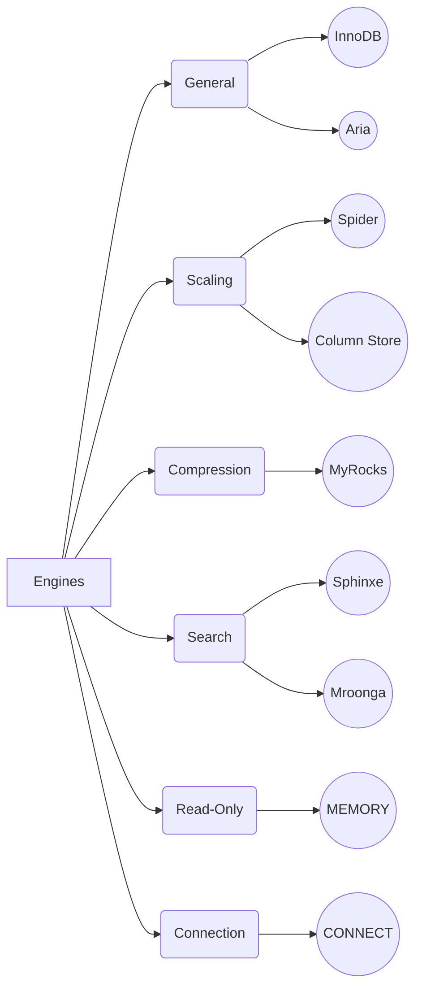

# MariaDB

## Database Engines

### General Purpose

-   [InnoDB](https://mariadb.com/kb/en/innodb/)  is a good general transaction storage engine, and the best choice in most cases. It is the default storage engine.
-   [Aria](https://mariadb.com/kb/en/aria/), MariaDB's more modern improvement on  [MyISAM](https://mariadb.com/kb/en/myisam/), has a small footprint and allows for easy copying between systems.

### Scaling, Partitioning

-   [Spider](https://mariadb.com/kb/en/spider/)  uses partitioning to provide data sharding through multiple servers.
-   [ColumnStore](https://mariadb.com/kb/en/columnstore/)  utilizes a massively parallel distributed data architecture and is designed for big data scaling to process petabytes of data.

### Compression / Archive

-   [MyRocks](https://mariadb.com/kb/en/myrocks/)  enables greater compression than InnoDB, as well as less write amplification giving better endurance of flash storage and improving overall throughput.

### Connecting to Other Data Sources

When you want to use data not stored in a MariaDB database.

-   [CONNECT](https://mariadb.com/kb/en/connect/)  allows access to different kinds of text files and remote resources as if they were regular MariaDB tables.

### Search Optimized

Search engines optimized for search.

-   [SphinxSE](https://mariadb.com/kb/en/sphinxse/)  is used as a proxy to run statements on a remote Sphinx database server (mainly useful for advanced fulltext searches).
-   [Mroonga](https://mariadb.com/kb/en/mroonga/)  provides fast CJK-ready full text searching using column store.

### Cache, Read-only

-   [MEMORY](https://mariadb.com/kb/en/memory-storage-engine/)  does not write data on-disk (all rows are lost on crash) and is best-used for read-only caches of data from other tables, or for temporary work areas. With the default  [InnoDB](https://mariadb.com/kb/en/innodb/)  and other storage engines having good caching, there is less need for this engine than in the past.

